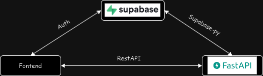

<p align="center">
  
</p>

<p align="center">
  <a href="https://opensource.org/licenses/MIT">
    
  </a>
  <a href="https://codecov.io/gh/Atticuszz/fastapi_supabase_template">
    
  </a>
  <a href="https://github.com/Atticuszz/fastapi_supabase_template/actions">
    
  </a>
  <a href="https://github.com/Atticuszz/fastapi_supabase_template/releases/">
    
  </a>
  
  <a href="https://supabase.com">
    
  </a>
</p>

# ⚡SupaFast⚡

___
> supabase & fastapi crud template



## Features 🚀

___

## How to use it


### install python dependencies

cd your repo and install dependencies with [uv](https://github.com/astral-sh/uv), which is an extremely fast Python package and project manager, written in Rust.

```shell
uv sync
```

### install supabase

1. [start your supabase locally](https://supabase.com/docs/guides/local-development/cli/getting-started?queryGroups=platform&platform=linux&queryGroups=access-method&access-method=postgres)

```bash
# brew in linux https://brew.sh/
brew install supabase/tap/supabase
supabase init
supabase start
```

2. set your supabase env

```shell
export SUPABASE_URL=your_supabase_url
export SUPABASE_KEY=your_supabase_key
```


### run

1. run server

```shell
uv run uvicorn app.main:app --reload
```

## Roadmap 🫶

___

- [x] FastAPI backend
  - [ ] Layered Architecture
      for <a href="https://github.com/tiangolo/fastapi" class="external-link" target="_blank">**FastAPI**</a> project
  - [ ] sqlmodel ORM supabase
    - [ ] config for fastapi and postgresql connection for supabase

  - [ ] **auto-auth** by fastapi dependency with supabase-auth
  - [ ] **CRUD** operations pytest
  - [ ] **api** requests pytest
- [ ] Supabase integration
  - [ ] crud supabase-postgresql
  - [ ] websocket with supabase-realtime
  - [ ] curd supabase-storage
  - [ ] supafunc integration
- [ ] deployment
  - [ ] Full **Docker** integration (Docker based).
